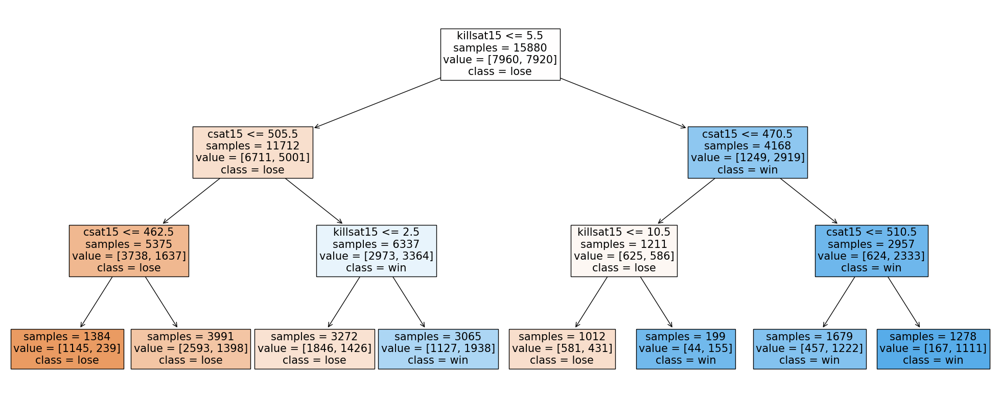
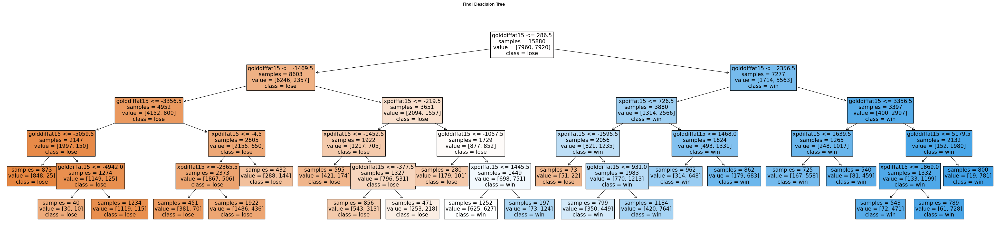

# The Cost of Winning

by: Edward New

## The Problem

When there are millions of dollars on the line in professional Esports, winning is the only thing that matters. Being able to predict which team wins or loses after seeing the data of an entire game is important since it reveals a lot of the key factors that affect a game's outcome. But doesn't that feel a little like cheating? Of course the team with a 5k gold lead and almost every objective won the game.

Let's see if we can improve on this prediction idea. We want to build a model that can predict which team will win or lose while the game is still going.

To do this, we'll start by looking at the game data at the 15 mintute mark to make our predictions.

The model we are trying to build is specifically a classifictaion model since instead of predicting some continuous numerical value, the model needs to make a binary decision on the outcome of the game it is looking at: Win or Lose.

The metric that we will use to measure the performance of our model is just the accuracy of the model. There is no real reason to use fancy performance metrics in this particlar case since our data is very symmetrical and there is not really a preferance for preventing against a particular type of error (False Positives or False Negatives).

Since we've made it a point to want to predict the outcome of a game while it is still going, we will only focus on data that is availiable at the 15 minute mark, which is on generally the half way mark through a game of League.

In particular we will look at:

-   kills at 15
-   cs at 15
-   gold at 15
-   xp at 15
-   turret plates (turret plates are only attainable in the first 14 minuites of any game)

## Baseline Model

Before doing any EDA, we will train a baseline model based on the intuitive factors that would affect a game's outcome. During the first phase of the game (known as the 'laning phase'), players usually focus on farming creeps to get their stats up and to buy items. Early kills are imporatant so players can snowball as the game goes on so the features that we will first focus on will be the number of kills at 15 and the collective cs score of the team at 15.

### Model Features:

As we just mentioned the baseline model only uses two quantitative features to make its classifications:

-   Kills at 15
-   CS at 15

We decide to not perform any transformations to these features to get a sense of where the model is currently at without much feature engineering. Additioanlly, we don't optimize for hyperparameters yet, we just choose an arbitrary tree max depth of 3 to get a sense of where the model is at initially.

### Model Results:

Unsuprisingly, the inital model does not have amazing performance.

-   Training Set Accuracy: 0.6669
-   Test Set Accuracy: 0.6562

Although, the model does show some promise, with a ~16% improvement over taking a 50/50 guess. The model has reltatively low bias since there are so few features and the tree depth is so shallow but it has pretty decent variance. We will try to improve the bias of this model by giving it some more features to work with and some more freedom to make more specific classification splits with deeper tree depths.

## Final Model

Now that we have an idea for how a very rudimentary model performs, we will try to improve on it.

The key idea motivating the choice of features for our final model is that giving the model more granularity for the state of the game at the 15 minuite mark will allow the model to make better decisions/classifications on the result of the game.

### Model Features:

Instead of looking at the data from the perspective of one team, we will try to give the model a more complete picture for the state of the game realtive to the team's opponenets as well. Thus, we will look at the difference of the feature values between the teams at the 15 minuite mark:

-   golddiffat15
-   xpdiffat15
-   csdiffat15
-   killsat15diff
-   turretplatesdiff

### Meta Features:

On top of the data that the model is being fed, we also make conscious decisions for what type of classifier we want to use and the hyper parameters we end up using for the training model. We decided to use a Binary Decision Tree Classifier because we want to be able to interpret the results of the model to gain some insights into what factors play a role in winning a game. Other classifiers such as Random Forests or a logistic classifier are great for making more accurate predictions but they are black boxes that are hard to learn from.

As for the model's hyperparemeters, we ran a GridSerach to find the most optimal max tree depth and minimum sample split size.
We found:

-   Max Depth: 5
-   Min Sample Split: 1200

### Model Results:

The final model did end up outperforming the Baseline Model.

-   Training Set Accuracy: 0.7471
-   Test Set Accuracy: 0.7395

However, it was interesting to see that most of the Decision Tree splits looked at the difference in gold and difference in xp between the teams. This came as a slight surprise since we would have thought that the model would leverage the extra granularity availiable to it to make more specific splits but this result does make sense.

Unfortunately, one of the big issues with a lot of the features that we use in our model is that a lot of them are ultimately colinear since a lot of the features are dependent on each other. For example, the more kills you have or the more turretplates you have, the more gold you have. So ultimately, gold will always be the most imporatant feature to look at.

This seems unavoidable since the entire game is like one big positive feedback loop of gaining gold and xp, leveraging that gold and xp to buy items, to ultimately get more gold, ... etc. until eventually one team gets strong enough to overpower the other.

An interesting route for further investigation could possibly be to add even more granularity to the model by giving it the individual differences in stats between the roles of a game (ex. jungle_golddiffat15, adc_xpdiffat15, etc.). Although it is likely these granualar features will have less importance/impact on the final outcome of the model compared to the overall gold and xp differences between the teams at 15 minuites.

## Fairness Analysis

We are curious to see if our final prediction model is better at predicting game outcomes depending on what side of the map the team it is trying to predict is playing on. Our evaluation metric of choice is going to be accuracy since we don't really have a preferance for False Positives versus False Neagatives. Our data is very symmetric since for each game on the red side, there is the opponents who play on the blue side.

-   Null Hypothesis: The accuracy of the prediction model is the same between red and blue side

-   Alternative Hypothesis: The accuracy of the prediction model is difference between red and blue side

We wont make an assumption for which way the alternative hypothesis should lean since there really is no intuitive guess for which side would be favored it there was a difference in performance.

-   Our test statistic of choice will be the absolute difference of mean accuracy
