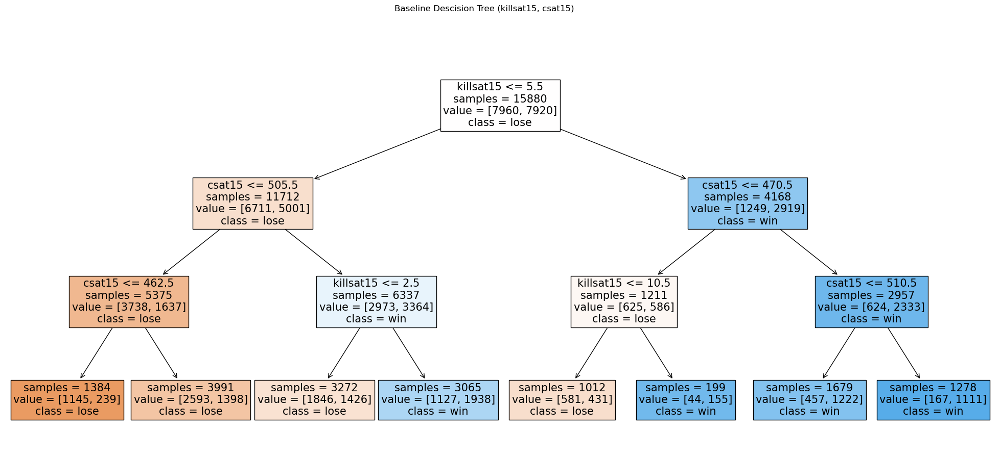

# League Win Predictor

by: Edward New

## The Problem

When there are millions of dollars on the line in professional Esports, winning is the only thing that matters. Being able to predict which team wins or loses after seeing the data of an entire game is important since it reveals a lot of the key factors that affect a game's outcome. But doesn't that feel a little like cheating? Of course the team with a 5k gold lead and almost every objective won the game.

Let's see if we can improve on this prediction idea. We want to build a model that can predict which team will win or lose while the game is still going.

To do this, we'll start by looking at the game data at the 15 mintute mark to make our predictions.

The model we are trying to build is specifically a classifictaion model since instead of predicting some continuous numerical value, the model needs to make a binary decision on the outcome of the game it is looking at: Win or Lose.

The metric that we will use to measure the performance of our model is just the accuracy of the model. There is no real reason to use fancy performance metrics in this particlar case since our data is very symmetrical and there is not really a preferance for preventing against a particular type of error (False Positives or False Negatives).

Since we've made it a point to want to predict the outcome of a game while it is still going, we will only focus on data that is availiable at the 15 minute mark, which is on generally the half way mark through a game of League.

In particular we will look at:

-   kills at 15
-   cs at 15
-   gold at 15
-   xp at 15
-   turret plates (turret plates are only attainable in the first 14 minuites of any game)

## Baseline Model

Before doing any EDA, we will train a baseline model based on the intuitive factors that would affect a game's outcome. During the first phase of the game (known as the 'laning phase'), players usually focus on farming creeps to get their stats up and to buy items. Early kills are imporatant so players can snowball as the game goes on so the features that we will first focus on will be the number of kills at 15 and the collective cs score of the team at 15.

### Model Features:

As we just mentioned the baseline model only uses two quantitative features to make its classifications:

-   Kills at 15
-   CS at 15

We decide to not perform any transformations to these features to get a sense of where the model is currently at without much feature engineering. Additioanlly, we don't optimize for hyperparameters yet, we just choose an arbitrary tree max depth of 3 to get a sense of where the model is at initially.

### Model Results:

Unsuprisingly, the inital model does not have amazing performance.

-   Training Set Accuracy: 0.6669
-   Test Set Accuracy: 0.6562

Although, the model does show some promise, with a ~16% improvement over taking a 50/50 guess. The model has reltatively low bias since there are so few features and the tree depth is so shallow but it has pretty decent variance. We will try to improve the bias of this model by giving it some more features to work with and some more freedom to make more specific classification splits with deeper tree depths.

## Final Model
